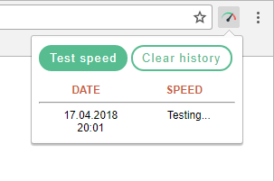
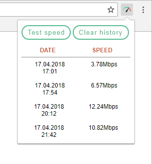
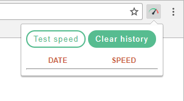

#### Martin Sõmer, 2018  
- - - -  

### Description:  
Small and easy to use Chrome extension for measuring Internet speed.  

### Features:  
* Simple and modern design  
* Connection speed testing  
* Keep test history  
* Clear test history  

### How to use:  
* Click on the icon to open the extension  
* Click on the icon again or outside the extension to close it  
* Click on *"Test speed"* to measure connection speed  
* Click on *"Clear history"* to clear the test history  

### How *NOT* to use:  
* Do not close the extension before the completion of the test, otherwise the test will not finish  
* Do not try to run multiple tests at the same time. It doesn't work by design  
* Do not try to clear test history while a test is running. It doesn't work by design  

### Images:  
  
  
  